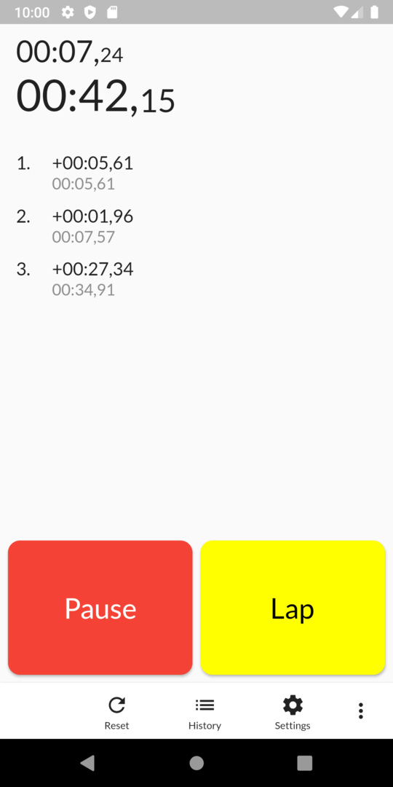

# Stopwatch

Opensource stopwatch for Android



## Getting Started

1. Install Android SDK : https://developer.android.com/studio
2. Install Flutter framework: https://docs.flutter.dev/get-started/install
3. Move to project folder and run: 
    ```
    flutter pub get
    flutter run
    ```
